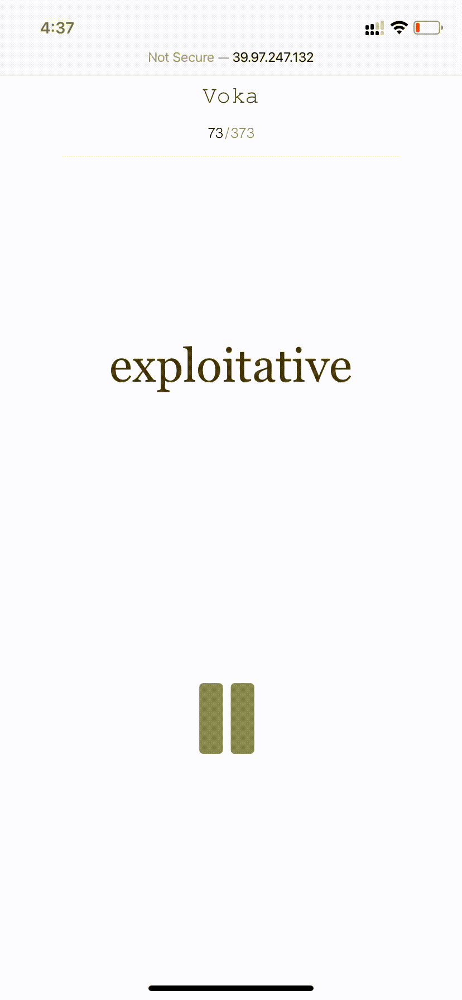

# Voka
Extreme tools for memorizing vocabularies.


# Feature
- Auto play to force concentration
- Shuffle each round
- Display meaning when you click pause button 

# Usage
1. Install python/nginx on your server.
2. `git clone https://github.com/HelloSilicat/Voka.git && cd Voka`
3. Prepare your voc.csv(like `assets/test.csv`) in `Voka/assets/`
4. Configure server ip and voc file name in `js/custom.js`, like:
   ```js
   let url = "http://localhost:9991/test.csv"; 
   ```
5. `bash run.sh`
6. Visit your remote server by 80 port(default).

# Demo

